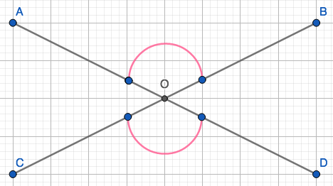

```{r, echo = F, out.width = "40%", fig.align='left', fig.cap='**Fig. 1: **Two intesecting lines segments form vertical angles, shown in pink.'}

```

To prove that two vertical angles are congruent, we need to prove two things :

1. $\angle AOB\cong \angle COD\Rightarrow m\angle AOB = m\angle COD$

2. $m\angle AOB = m\angle COD\Rightarrow \angle AOB\cong \angle COD$

$\underline{\text{Proof}}$: 

1. $\angle AOB\cong \angle COD\Rightarrow m\angle AOB = m\angle COD$

Suppose $\angle AOB\cong \angle COD$. 

Then there is an isometry that superimposes $\angle AOB$ onto $\angle COD$. 

Let $f$ be that isometry : $f(\angle AOB)=\angle COD$.

Isometries preserve angle. 

The angle measure of $f(\angle AOB)$ equals the angle measure of $\angle COD$. 

So by substitution $m\angle AOB=m\angle COD$. 

2. $m\angle AOB = m\angle COD\Rightarrow \angle AOB\cong \angle COD$

Suppose $m\angle AOB = m\angle COD$. 

Since by definition of vertical angles, $\angle AOB$ and $\angle COD$ are across from each other, there is a reflection, $f(m\angle AOB)$ about the origin (O). 

We also know that there are four pairs of supplementary angles, two of which are: 

- $m\angle AOB+m\angle BOD=180^\circ$

- $m\angle BOD+m\angle COD=180^\circ$

So, $m\angle AOB+m\angle BOD=m\angle BOD+m\angle COD$. 

And if we subtract $m\angle BOD$ from both sides we get, $m\angle AOB=m\angle COD$. 

It would then make sense that $f(O)=O$, $f(A)=C$, and $f(B)=D$. 

Then by definition of reflection $f(m\angle AOB)=m\angle COD$. 

Therefore by the Congruence and Angle measure theorem $\angle AOB\cong \angle COD$.

$\square$


